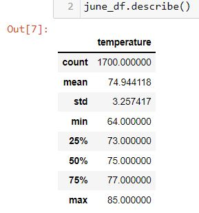

 Module 9 Challenge – Surf's Up
 
**#Purpose**
    
    The purpose of this analysis is to gather temperature data for the months of June and December in 
    
    Oahu, in order to determine if the surf and ice cream shop business is sustainable year-round.
    
**#Results:**

    • June has a max temperature of 85 degrees and December has a max temperature of 83 degrees.
    
    • December has a minimum temperature of 56 degrees and June has a minimum temperature of 64 degrees.
    
    •There is noticeable difference between the temperature count of June (1700) and December(1517). 
    
    

**#Summary:**

    Based on the information gathered it can be observed that June is a great month for the surf and ice 
    
    cream shop business especially with a hottest temperature reaching 85 degrees. December is not far 
    
    behind although it includes some cooler temperature as low as 56 degrees. All in all, both June and 
    
    December prove that the surf and ice cream shop business is sustainable year-round. We could 
    
    also include a query to count the number of stations the information was gathered by to prove its 
    
    reliability, Lastly, a query to calculate the time of day when the temperature is most ideal for 
    
    sales. 